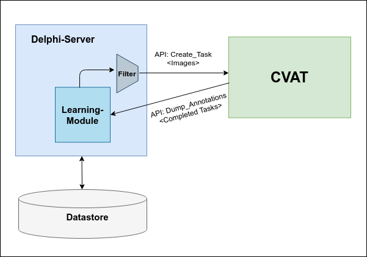

# delphi-cvat

## Decription 
Delphi is an interactive system that performs bandwidth-efficient
labeling for low-baserate targets. In this repository, we integrate Delphi with
[CVAT](https://github.com/openvinotoolkit/cvat) to prune negatives
from a given image directory.

Delphi creates the intial filter from a set of labeled data
provided by the user. A minimum of 5 images per label (positive &
negative) are required to start the filter. Delphi achieves
bandwidth effiecieny through early-discard and iterative
improvement of classifiers. When the user marks a task as
"completed" in CVAT, Delphi retrieves the annotation file from CVAT
to expand the labeled set and re-train the classifier.

This is a developing project.

## System Architecture
<p align="center">
  
</p>


## Environment setup
This code has been tested on Ubuntu 16.04, Python 3.7, Pytorch 1.5, CUDA 10.2, GTX 1080 GPUs

- Clone the repository 
```
git clone https://github.com/a4anna/delphi-cvat && cd delphi-cvat
export DELPHI=$PWD
```
- Setup python environment
```
conda env create -f environment.yml
conda activate delphi
```
- Set environment variable
```
export CVAT_USER={CVAT-USERNAME}
export CVAT_PASS={CVAT-PASSWORD}
export PYTHONPATH=$DELPHI:$PYTHONPATH
```
## Data Directory Structure
```
+data-root/  
  +labeled/  
    +0/ # labeled negative image ddirectory  
      -000.jpg  
      -501.jpg  
      -*.jpg     
    +1/ # labeled positive image ddirectory  
      -011.jpg  
      -203.jpg  
      -*.jpg  
  +unlabeled/  
    -*.jpg  
```   
## Generate proto files
```
 cd $DELPHI
 python generate_proto.py
```
## How to Run

#### Launch CVAT  
Instructions on how to install and run CVAT can be found [here](https://github.com/openvinotoolkit/cvat/blob/develop/cvat/apps/documentation/installation.md).   
*Note: Currently, we only support "Tag Annotation".*

#### Modify config.yml

#### Start Delphi 
```
./run.sh
``` 

